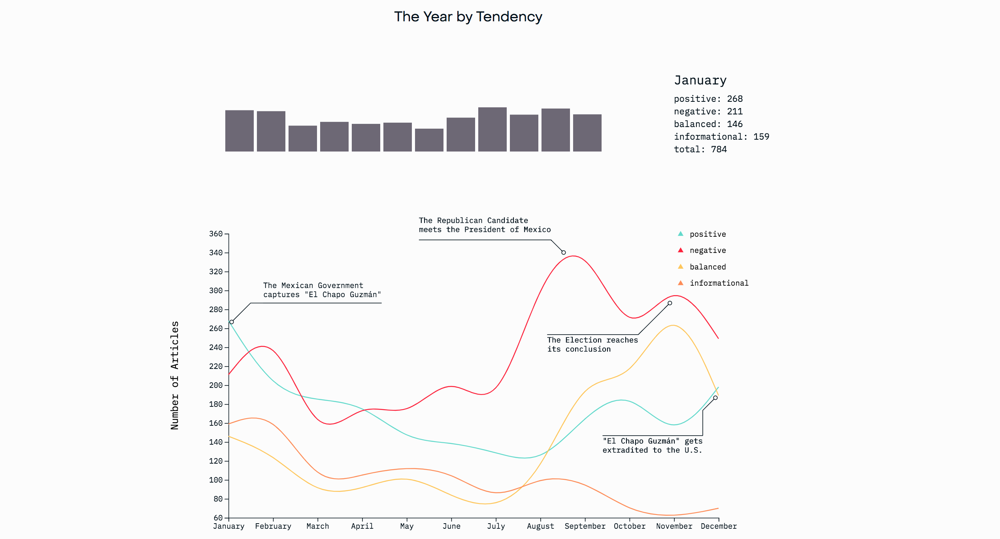
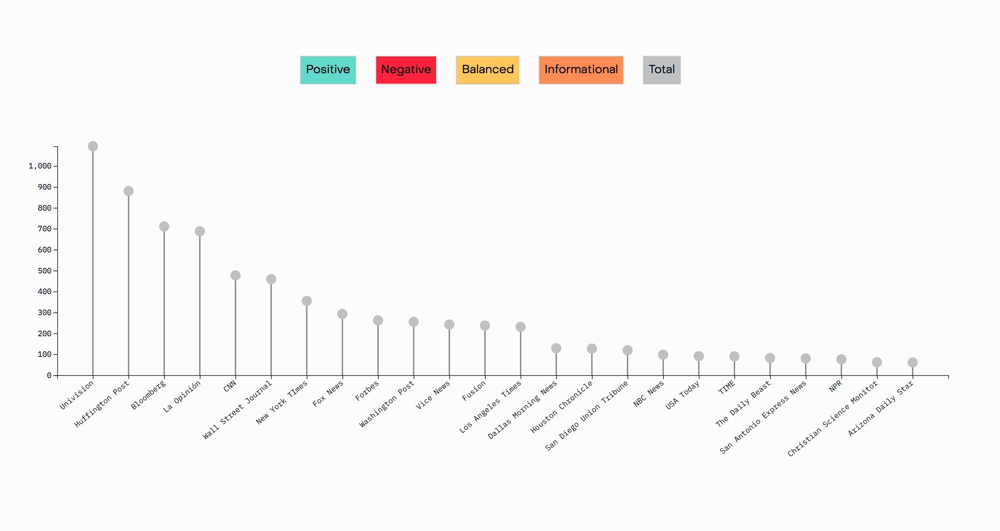
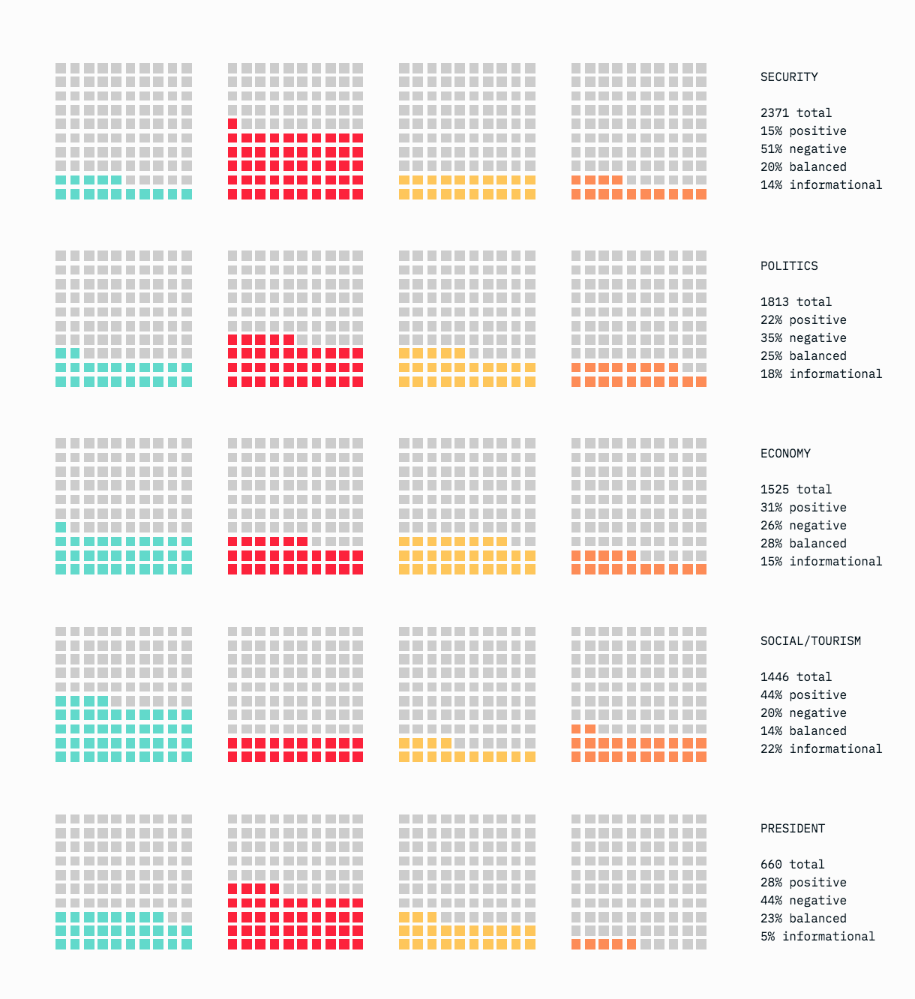
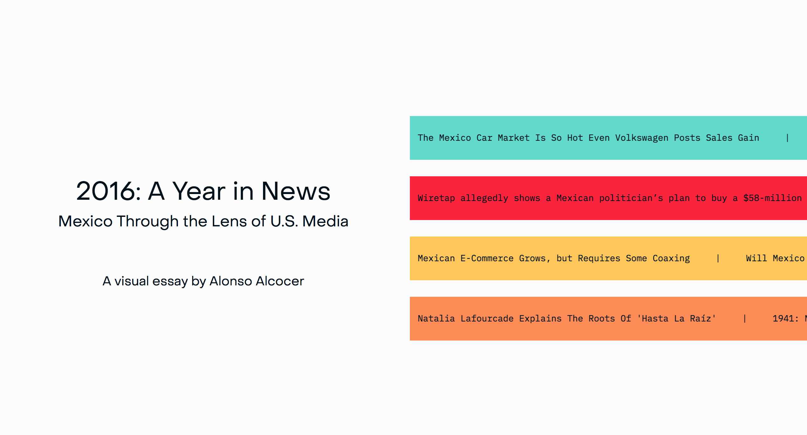

# 2016: A Year in News – Mexico Through the Lens of U.S. Media

## A visual essay of U.S. media coverage of Mexico in 2016.

### Abstract

The following visual essay explores the behavior of the U.S. media at a historical turning point in the bilateral relations between the U.S. and Mexico. The project is based on data gathered by the team of international media analysts of former Mexican President, Enrique Peña Nieto. It encompasses 67 media outlets and over 7,000 articles, thus offering the reader a unique opportunity to visualize the effects of the 2016 U.S. Presidential Election through the eyes of one of its closest allies.

### Screen Captures

